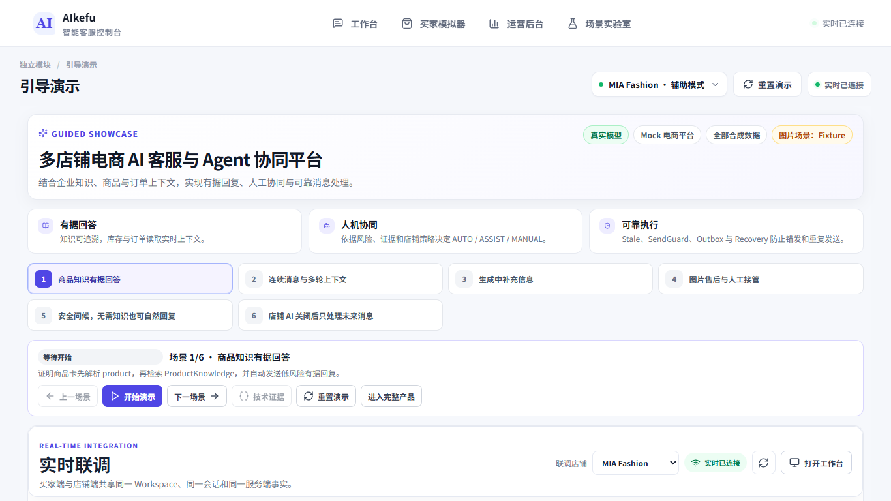
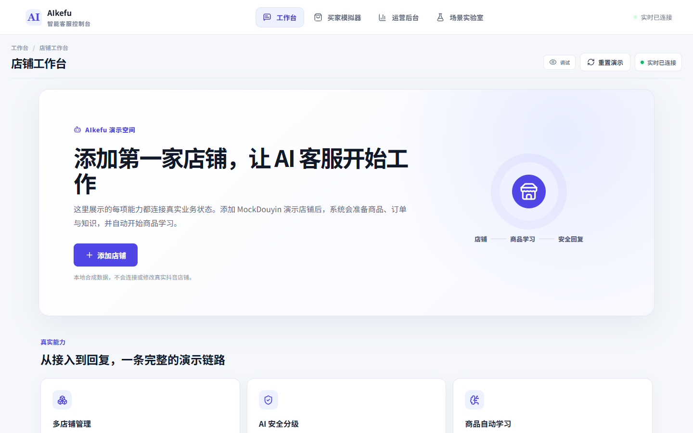
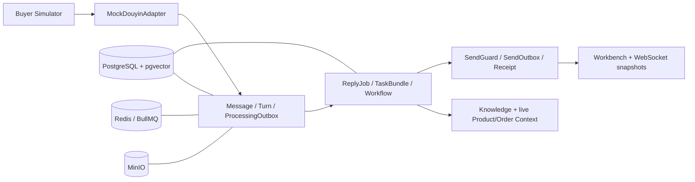

# AIkefu｜多租户电商 AI 智能客服 Demo


**当前版本：[`v1.1.0-demo`](https://github.com/LYCMYT/AIkefu/releases/tag/v1.1.0-demo)｜Mock-only｜Synthetic Data**

**历史版本：[`v1.0.0-demo`](https://github.com/LYCMYT/AIkefu/releases/tag/v1.0.0-demo)**

**交付基线：Phase 05 完整收口**

**项目形态：Web-first、本地可复验的求职展示 Demo**
**核心原则：核心状态机、持久化链路和 UI 使用真实实现；外部电商平台仅使用 Mock Adapter。**

本仓库是一个合成数据 Demo，不是已上线的电商客服产品。默认运行不需要真实平台账号或模型密钥；需要真实 PostgreSQL / Redis / MinIO 验收时，必须显式启动 Docker 并打开 opt-in 开关。当前文档不声称在线部署、生产 SLA 或商业 KPI。

## 三分钟演示

[](https://github.com/LYCMYT/AIkefu/releases/download/v1.1.0-demo/aikefu-3min-demo.mp4)

`v1.1.0-demo` 演示为 174.933 秒、1920×1080、30 fps、H.264/AAC、`zh-CN-XiaoxiaoNeural` `+45%` 在线神经语音、29 条字幕 cue、画面硬字幕与同源外部 SRT，MP4 无软字幕轨。文件大小 9,165,137 bytes，SHA256 为 `E8BFA8D0E41CBEEDC1F186C3497200BDDF46B682D7BBC0608764F70DF9CEB9DC`。语音明确属于 TTS 版本，不冒充真人配音。

建议先从 `/showcase` 了解六条主链，再进入工作台、买家模拟器、AI 管理中心和场景实验室。发布说明见 [`docs/RELEASE_V1.1.0_DEMO.md`](docs/RELEASE_V1.1.0_DEMO.md)，简历与面试文案见 [`docs/PORTFOLIO_RESUME_COPY.md`](docs/PORTFOLIO_RESUME_COPY.md)。

## 本轮发布收口（2026-08-31）

本节只记录当前工作区已经落盘并在本地复验的能力；任何“通过”均不等同于公网部署、真实电商平台接入或生产验收。

- Workspace 已分为两个互不共享的浏览器会话：运营工作台使用 `EMPTY`，Scenario Lab 使用 `SEEDED`；创建和 Reset 都维持各自的 profile。浏览器仅使用本地 `aikefu_operational_workspace_token_v2` 与 `aikefu_scenario_workspace_token` 两个 token key，旧的共享 key 不会被读取、覆盖或清除；服务端仍只持久化 token hash。
- 空店首次进入 `/workbench` 会展示建店首页；选择服饰或数码 MockDouyin 模板后创建店铺并触发商品学习。学习期间为 `PREPARING`，不会自动发送；只有学习成功后才投影为 `READY`。`DEGRADED` / `FAILED` 继续按失败关闭语义处理。
- 店铺 AI 开关是二元的：`ON = AUTO_ALLOWED`，`OFF = MANUAL_ONLY`。关闭时，买家消息仍留在人工作业上下文，但不会生成伪装为人工的 AI Job；持久化 receipt 会阻止之后重新开启 AI 时复活关闭期间的工作。`ASSIST_ONLY` 不是这个总开关的中间态。
- 已接入的店铺级路由为 `/workbench/shops/:shopId`、`/workbench/shops/:shopId/settings`、`/workbench/shops/:shopId/knowledge/import` 和 `/live-test/:shopId`。设置页会读写当前 Workspace/店铺的真实设置；知识导入页调用服务端 CSV/XLSX 预览、行级校验与确认提交，不是本地静态样例。

### 当前 Gate 与未完成项

| 范围 | 当前状态 |
| --- | --- |
| Unit | 708 / 708 通过（Release hygiene、录制合同、Contracts、Core、Mock、Web、API） |
| API integration | 15 suites / 64 tests 通过，使用本地真实 PostgreSQL、Redis、MinIO 与 pgvector |
| Contracts | 6 / 6 通过 |
| 前端终态 Gate | Playwright 共 27 个唯一用例；真实环境 23 passed、4 skipped、0 failed，离线模式 6 passed、21 skipped、0 failed；两种模式均按真实状态保留互斥 skip |
| Q0 生产回复评测 | 固定集：Offline 36 / 36、DeepSeek 36 / 36（21,463 / 2,540 Token，平均 2,326 ms）；独立 AUTO 集：Offline 10 / 10、DeepSeek 10 / 10（8,675 / 1,143 Token，平均 2,283 ms） |
| 公网部署 | 未完成；没有把本地服务或容器验收表述为在线 Preview |
| 3 分钟演示视频 | [`v1.1.0-demo` Release asset](https://github.com/LYCMYT/AIkefu/releases/download/v1.1.0-demo/aikefu-3min-demo.mp4)；174.933 秒、1920×1080、30 fps、H.264 + AAC；Xiaoxiao `+45%` 在线神经语音、29 条 cue、画面硬字幕 + 外部 SRT、MP4 无软字幕轨 |
| 真实外部凭据 | DeepSeek Key 仅从仓库外服务端文件读取并已完成真实评测；真实电商平台凭据仍不在 V1 范围，任何 Secret 都不随仓库交付 |

真实基础设施 Gate 已在本机 opt-in 环境通过，但尚未部署到公网。





截图基线由连接真实本地服务的 Playwright 流程生成。当前 1440×900 终态证据包括 [空店首页](artifacts/ui/final/empty-home.png)、[店铺概览](artifacts/ui/final/shop-overview.png)、[店铺聊天](artifacts/ui/final/shop-chat.png)、[基础设置](artifacts/ui/final/shop-settings.png)、[知识导入](artifacts/ui/final/knowledge-import.png)、[AI 管理中心](artifacts/ui/final/admin.png)、[Workflow](artifacts/ui/final/workflow.png)、[Buyer Simulator](artifacts/ui/final/buyer-simulator.png)、[实时联调](artifacts/ui/final/live-test.png) 与 [Scenario Lab](artifacts/ui/final/scenario-lab.png)。Workflow 图保持真实运营 Workspace 的空态，没有为截图制造工作流数据。项目仍无公网全栈托管地址，不使用本地链接冒充公开 Preview；Release 视频是主要公开展示入口。

## 展示范围

四个一级入口固定为：

- `/workbench`：客服接待工作台，展示 AUTO / ASSIST / MANUAL、AI Draft / Human Final、Draft TTL、接管/恢复、ReplyJob / Send 状态与真实 Trace 开关。
- `/buyer-simulator`：合成买家消息、商品卡和订单卡入口。
- `/admin`：真实 Workspace 数据概览；子页包括 `/admin/shops`、`/admin/products`、`/admin/knowledge`、`/admin/workflows`、`/admin/quality`、`/admin/incidents`、`/admin/usage`、`/admin/privacy`。
- `/scenario-lab`：固定 8 个 synthetic Scenario 的运行与重置。

公开讲解和录屏的首选入口是 `/showcase`。它使用第三个独立的 `SEEDED` Showcase Workspace，会按顺序运行商品知识、多轮聚合、生成中补充信息、图片售后/人工接管、安全问候和 AI 暂停/恢复六条真实 API/WebSocket 链路；不会改写运营 Workspace 或 Scenario Lab。页面明确标注模型 Provider、Mock 电商平台、合成数据和图片 Fixture 边界。

Trace 默认隐藏。可直接打开 `/workbench?trace=1`，或在 Workbench 点击 Trace；只有显式开启时才请求 `trace=1` 的 Developer Trace 数据。Trace 面板只展示结构化、脱敏事件，不展示 prompt、私有推理或 Chain-of-Thought。

## Mock-only 与数据边界

- V1 只实现 `MockDouyinAdapter`；不接真实抖音或其他平台 API，不复制私有接口、Cookie、Token 或认证材料。
- Seed、聊天、商品、订单、物流、图片和 Scenario 均为合成数据。其他平台只能显示规划入口。
- 默认 AI provider 是离线确定性 provider。服务端现支持原有 JSON gateway、`AI_PROVIDER=deepseek`，以及显式 `AI_PROVIDER=openai-compatible` / `responses` 的标准 Chat Completions / Responses JSON 模式。`AI_BASE_URL` 不再猜测 wire format；密钥可通过 `AI_API_KEY` 或本机 `AI_API_KEY_FILE` 读取，不得使用 `VITE_*`，也不会进入前端 Bundle、URL、WebSocket 或普通日志。
- 图片默认使用本地确定性分析；只有服务端 `.env` 中 `AI_EXTERNAL_IMAGE_ANALYSIS_OPT_IN=true`（精确值）才允许外部多模态运行时接收原图。图片仍属于 Untrusted 数据。
- 公开 Demo 不提供 Workspace Quota、Rate Limit 或超额 Fallback；这是已知费用风险，不是商业指标承诺。

## 本地启动

前置条件：Node.js、仓库锁定的 pnpm（`package.json` 声明 `pnpm@9.15.9`），以及 Docker Desktop 或兼容的 Docker Compose。Compose 文件只启动 PostgreSQL/pgvector、Redis 和 MinIO 依赖；API 与 Web 仍由本机 `pnpm dev` 启动。

```bash
pnpm install
cp .env.example .env
pnpm infra:up
pnpm db:deploy
pnpm dev
```

Windows PowerShell：

```powershell
pnpm install
Copy-Item .env.example .env
pnpm infra:up
pnpm db:deploy
pnpm dev
```

默认地址：Web `http://localhost:5173`，API `http://localhost:3000/api`，MinIO Console `http://localhost:9001`。首次进入运营工作台会创建匿名 `EMPTY` Workspace，Scenario Lab 则使用独立的 `SEEDED` Workspace；明文 Workspace token 只在创建时返回，数据库保存 hash。

停止依赖：

```bash
pnpm infra:down
```

不要提交 `.env`；只提交 `.env.example`。示例文件中的 `minioadmin` 是本地 Compose 占位凭据，不是平台凭据。

## 单机生产风格部署

仓库同时提供完整的 `docker-compose.prod.yml`：Nginx 以同源 `/api` 与 `/ws` 反向代理单副本 NestJS API，PostgreSQL/pgvector、Redis 与 MinIO 只放在内网。首次启动会自动执行 `prisma migrate deploy`。

```powershell
Copy-Item .env.production.example .env.production
# 替换所有 CHANGE_ME_* 值；.env.production 已被 Git 忽略。
docker compose --env-file .env.production -f docker-compose.prod.yml up -d --build --wait
```

默认访问 `http://localhost:8080`。线上服务器应在 Web 容器前终止 TLS，并将 `WEB_ORIGIN` 设为真实 HTTPS Origin。完整的密钥边界、健康检查、升级和停机命令见 [`docs/DEPLOYMENT.md`](docs/DEPLOYMENT.md)。

`.github/workflows/ci.yml` 会在 push/PR 时先执行 Secret scan、frozen install、Prisma generate、typecheck、unit、默认 integration 与 build；随后在隔离 job 中真实启动 PostgreSQL/pgvector、Redis、MinIO，部署 migration，执行非跳过的 real-infra integration，并启动 API/Web 跑连接态 Playwright。`container-images.yml` 在 `main`、`v*` Tag 或手动触发时将 API/Web 镜像发布到 GitHub Container Registry。GitHub 负责代码、CI/CD 与镜像，真正的常驻运行仍需 Linux 主机或兼容的容器平台。

发布源码包不要压缩整个工作目录。先确保工作区已提交且干净，再运行：

```powershell
pnpm security:secrets
pnpm release:archive
```

归档脚本只从当前 Git commit 取已跟踪文件，并拒绝 `.env`、依赖、构建产物、缓存、测试报告和内部 `references/`；产物写入被忽略的 `release-artifacts/`。CI 也会对每次 push/PR 执行同一高置信 Secret 扫描与 frozen-lockfile 安装。

## 环境变量

`.env.example` 是本地开发模板，`.env.production.example` 是单机容器部署模板；两者都不包含真实 Secret：

| 变量 | 用途 | 默认/边界 |
| --- | --- | --- |
| `DATABASE_URL` | PostgreSQL/pgvector 连接 | 本地 Compose 数据库 |
| `REDIS_URL` | BullMQ/Redis 连接 | 本地 Compose Redis |
| `S3_ENDPOINT`、`S3_BUCKET`、`S3_REGION`、`S3_ACCESS_KEY`、`S3_SECRET_KEY`、`S3_FORCE_PATH_STYLE` | MinIO/S3 兼容对象存储 | 示例值仅用于本地 MinIO |
| `ATTACHMENT_STORAGE_TIMEOUT_MS`、`JSON_BODY_LIMIT` | 对象存储硬超时与普通 JSON 请求体上限 | `8000`、`1mb` |
| `WEB_ORIGIN`、`API_PORT`、`WS_PATH` | API CORS、端口与 WebSocket 路径 | `5173`、`3000`、`/ws` |
| `VITE_API_BASE_URL`、`VITE_WS_BASE_URL`、`VITE_WS_PATH` | 浏览器 API/WS 地址 | `VITE_WS_BASE_URL` 留空则使用当前 origin；仅可放公开地址，不能放 Secret |
| `DEMO_WORKSPACE_IDLE_EXPIRY_HOURS` | Demo Workspace 空闲清理 | `24` |
| `AI_PROVIDER`、`AI_API_STYLE`、`AI_BASE_URL`、`AI_API_KEY` / `AI_API_KEY_FILE`、`AI_*_MODEL`、`AI_TIMEOUT_MS` | 服务端可选 JSON gateway / DeepSeek / OpenAI-compatible provider | 留空使用离线 provider；配置 URL 时必须显式声明 provider。Key 只在服务端。可用 `pnpm ai:probe` 做结构化探针 |
| `AI_EXTERNAL_IMAGE_ANALYSIS_OPT_IN` | 外部图片分析开关 | 精确 `true` 才开启，默认 `false` |
| `RUN_REAL_INFRA_INTEGRATION` | 真实 PostgreSQL/pgvector/MinIO 验收开关 | `0`；不会自动启动 Docker |

## 质量命令

默认单测、类型检查和构建不代表真实基础设施已启动。建议提交前运行：

```bash
pnpm typecheck
pnpm ai:eval:production:offline
pnpm ai:eval:auto:offline
# 配置真实服务端 Provider 后：
pnpm ai:eval:production
pnpm ai:eval:auto
pnpm test:unit
pnpm test:integration
pnpm test:e2e
pnpm build
```

`pnpm test:e2e` 使用本机 Chrome 运行四入口桌面/窄屏与 Foundation 可恢复错误态门禁；默认不需要后端。若已启动并迁移完整本地基础设施，可将 `RUN_REAL_INFRA_E2E=1` 与可选 `E2E_BASE_URL` 一起设置，以运行真实连接状态的 opt-in 浏览器用例。默认跳过不能记作真实基础设施通过。

定向命令：

```bash
pnpm --filter @ai-customer-service/contracts typecheck
pnpm --filter @ai-customer-service/contracts test:unit
pnpm --filter @ai-customer-service/contracts build
pnpm --filter @ai-customer-service/web typecheck
pnpm --filter @ai-customer-service/web test:unit
pnpm --filter @ai-customer-service/web build
```

Web 单测包含 Workflow 编辑器、Phase05 API/OpenAPI/WS、Trace 脱敏与路由/发布文档契约。真实基础设施套件默认跳过；在确认 Docker 已启动、迁移已部署后，显式运行：

```bash
# macOS / Linux
RUN_REAL_INFRA_INTEGRATION=1 pnpm exec dotenv -e .env -- pnpm --filter @ai-customer-service/api test:integration

# Windows PowerShell
$env:RUN_REAL_INFRA_INTEGRATION = '1'
pnpm exec dotenv -e .env -- pnpm --filter @ai-customer-service/api test:integration
Remove-Item Env:RUN_REAL_INFRA_INTEGRATION
```

真实浏览器入口复验：

```powershell
$env:RUN_REAL_INFRA_E2E = '1'
$env:E2E_BASE_URL = 'http://127.0.0.1:5173'
pnpm test:e2e
Remove-Item Env:RUN_REAL_INFRA_E2E
Remove-Item Env:E2E_BASE_URL
```

该开关只验证本地 PostgreSQL/pgvector、Redis 与 MinIO 的持久化、隔离、索引、Outbox 与恢复边界，从不调用真实平台或模型。当前 opt-in 真实基础设施 Gate 已在本机通过；若未启动相应依赖，不要把 skipped 当作真实 infra PASS，也不要把本地 PASS 表述为公网部署。

OpenAPI 与 WebSocket JSON schema 的引用、数组 items、discriminator 和 Phase05 DTO 由 Web contract tests 检查；它们不等同于在线部署或 E2E 全量验收。

## 演示复现

仓库提供 `/showcase` 引导页、SC01–SC06 六个可重复场景、真实运行截图、证据清单和可复现录制脚本；`v1.1.0-demo` Release 提供最终视频，生成文件不进入 Git 源码历史。

人工演示顺序、输入文本、预期状态和每一步的验证边界见 [`docs/18_DEMO_SCRIPT.md`](docs/18_DEMO_SCRIPT.md)。演示前至少执行：

```bash
pnpm --filter @ai-customer-service/contracts build
pnpm --filter @ai-customer-service/web test:unit
pnpm --filter @ai-customer-service/web build
```

演示前打开 `/showcase`，确认 API/WS 已连接并点击“重置演示”。Showcase 与运营/Scenario 会话隔离；截图与 `artifacts/showcase/SHOWCASE_EVIDENCE.md` 是自动化验收证据，但仍不等同于最终录制视频或公网部署。

录制与成片使用同一条 Showcase 链；`demo:*` 是当前 Showcase 命令的兼容别名，旧 1440×900 工具只保留在 `legacy:demo:*`：

```powershell
pnpm showcase:record
pnpm showcase:build
# 或在 API/Web 已启动时一键录制并构建：
pnpm showcase:video
```

## 安全与已知限制

安全边界详见 [`docs/14_SECURITY_PRIVACY.md`](docs/14_SECURITY_PRIVACY.md)，冻结取舍详见 [`docs/16_DECISION_LOG.md`](docs/16_DECISION_LOG.md)，已知限制详见 [`docs/19_KNOWN_LIMITATIONS.md`](docs/19_KNOWN_LIMITATIONS.md)。本交付明确无真实平台 Secret，不声称在线部署，不虚构商业 KPI，也不声称满足生产 SLA、安全认证或大规模并发。

API 在监听端口前会校验生产环境、注册严格的运行时 Body DTO 校验、普通 JSON 总体积上限与 Helmet 安全响应头；附件使用官方 AWS SDK v3，并对对象存储网络操作设置硬超时。配置的 JSON 模型 Gateway 只对网络、超时、408/429 与选定 5xx 重试一次，认证/请求/无效响应失败关闭且不重试；内存 Usage 仅保留最近 1,000 条，Prisma 账本才是审计事实源。冻结决策仍明确不在 V1 增加 Workspace 防刷 Quota/Rate Limit，因此任何公网 Preview 必须把该费用风险纳入访问控制或保持离线确定性 Provider。

## 目录

```text
apps/api/       NestJS API、Prisma、Workers（仅本地/合成运行）
apps/web/       React + TypeScript 四入口 Web
packages/       contracts、core、mock-douyin 等共享包
specs/          OpenAPI、WebSocket、JSON Schema、Prisma 草案
seed/           合成 Seed、导入模板、Eval Cases
docs/           需求、架构、测试、安全、演示与限制
codex/          分阶段执行指令
```
