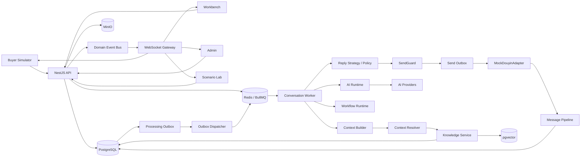

# 系统整体架构

## 1. 目标

系统必须同时满足：

- 在线 Demo 易访问
- 核心机制真实实现
- 外部平台可替换
- 多 Workspace / 多店铺隔离
- 事件驱动
- 可恢复
- 可测试
- AI 调用可追踪

---

## 2. Monorepo 建议

```text
apps/
  web/                 React Web
  api/                 NestJS API + Workers

packages/
  contracts/           DTO、事件、Schema、共享枚举
  core/                领域规则、状态机、Policy
  ai-runtime/          Provider、Routing、Structured Output
  knowledge/           Import、ProductLearning、Hybrid RAG
  workflow/            Workflow Definition / Runtime
  mock-douyin/         MockDouyinAdapter 与 Business Events
  observability/       Trace、Usage、Audit
```

也可把 Worker 作为 `apps/worker` 独立进程；V1 允许 API 与 Worker 同仓部署，但模块必须分离。

---

## 3. 逻辑架构



---

## 4. 数据存储

### PostgreSQL

Source of Truth：

- Workspace / Tenant
- Shop
- Buyer
- Product / SKU
- Order
- Knowledge / Version
- Conversation / Message / UserTurn
- ReplyJob / Draft
- Workflow
- Outbox
- Trace
- Quality / Incident
- Usage

### pgvector

- KnowledgeVersion embedding
- 只索引 `ENABLED + READY + activeVersion`

### Redis / BullMQ

- Processing jobs
- TurnBuffer delayed flush
- Reply generation
- Product learning
- Knowledge indexing
- Workflow execution
- Recovery tasks
- Scheduled messages

Redis 不是最终真相；关键任务状态必须落 PostgreSQL。

### MinIO / S3

- 图片附件
- 通过 Signed URL 访问
- 默认 15 天清理

---

## 5. Adapter 层

`CommerceAdapter` 负责平台差异：

```ts
interface CommerceAdapter {
  probe(): Promise<AdapterDescriptor>;
  bootstrap(shopHint?: ShopHint): Promise<ShopSession>;
  listPending(cursor?: Cursor): Promise<Page<ConversationSummary>>;
  openConversation(ref: ConversationRef): Promise<ConversationSnapshot>;
  readMessages(ref: ConversationRef, cursor?: Cursor): Promise<Page<ChatMessage>>;
  getCustomerContext(ref: ConversationRef): Promise<CustomerContext>;
  send(ref: ConversationRef, action: ReplyAction, guard: SendGuard): Promise<SendReceipt>;
  markRead(ref: ConversationRef, throughSequence?: string): Promise<void>;
  transfer(ref: ConversationRef, target: TransferTargetRef, reason: string): Promise<TransferReceipt>;
  getLogistics(order: OrderRef): Promise<LogisticsSnapshot>;
  subscribe(handler: (event: AdapterEvent) => void): Unsubscribe;
  refresh(reason: RefreshReason): Promise<void>;
  shutdown(): Promise<void>;
}
```

V1 只有 `MockDouyinAdapter`。

其他平台只展示 Planned，不创建虚假 Adapter。

---

## 6. 事件驱动边界

### 业务数据库与队列

使用 Transactional Processing Outbox：

```text
同一事务：
Message / Business State
+
ProcessingOutbox Event
```

Dispatcher 至少一次投递 BullMQ。

消费者幂等。

### 平台写入

使用 SendOutbox：

```text
PENDING
→ SENDING
→ SENT
```

异常：

```text
FAILED
UNCERTAIN
```

`SENDING` 状态服务崩溃后转 `UNCERTAIN`，不自动重发。

---

## 7. 前后端通信

### REST

命令和查询。

### WebSocket

实时通知。

### 原则

- DB 是真相
- WebSocket 不负责补历史
- WebSocket 重连后 REST 拉快照
- Event 包含 eventId / entityId / entityVersion
- Workspace 严格过滤

---

## 8. AI Runtime

职责：

- purpose-based routing
- timeout
- retry once
- fallback
- structured output
- schema validation
- repair once
- circuit breaker
- token / cost
- abort / stale discard

模型不能直接执行业务 Tool。

---

## 9. Context Pipeline

```text
UserTurn
→ Intent Planner
→ TaskBundle
→ Context Resolver
→ FactContext
→ Context Sanitizer
→ Knowledge Retrieval
→ Reply Policy
→ Reply Strategy
```

实时事实不进入向量知识。

---

## 10. 可恢复性

启动 Recovery Worker 扫描：

- ReplyJob
- SendOutbox
- WorkflowRun
- ActionProposal
- TurnBuffer
- ScheduledMessageJob
- ProcessingOutbox

恢复策略见 `docs/06_STATE_MACHINES.md`。

---

## 11. 部署建议

### 本地开发

Docker Compose：

- postgres
- redis
- minio
- api
- web

### 在线 Demo

可采用：

- Web 静态托管
- API / Worker 容器
- 托管 PostgreSQL / Redis
- S3 兼容存储

不要求 Kubernetes。

### Secret

AI Key、DB、MinIO Secret 只保存在服务端环境变量或 Secret Manager。

---

## 12. 性能初始参数

```text
Conversation concurrency = 1
Shop AI generation concurrency = 3
Global AI generation concurrency = 6
Shop send concurrency = 1
Reorder wait = 1s
Turn idle = 2s
Turn hard max = 5s
Assist Draft TTL = 5min
Conversation idle close = 30min
AI timeout = 8s
```

V1 不实现店铺公平调度器，只在架构文档保留生产优化建议。
