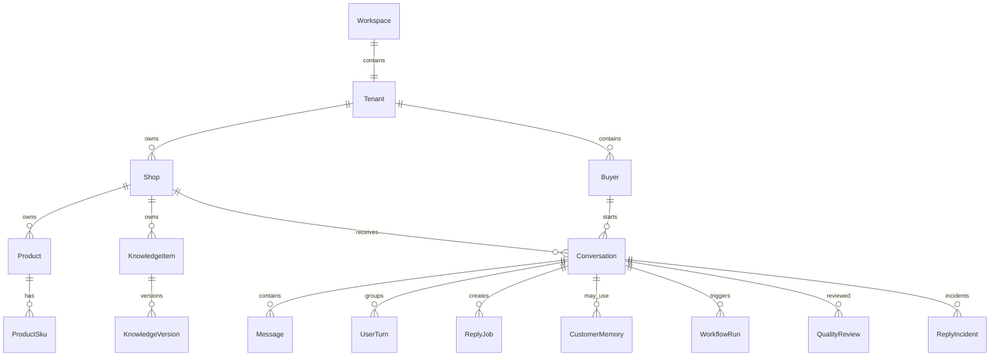

# 领域模型与数据库设计

## 1. 核心关系



---

## 2. 隔离键

所有核心表必须至少包含：

```text
workspaceId
tenantId
```

店铺级表再包含：

```text
shopId
```

消费者相关查询不得仅按 buyerId 或 conversationId 查询。

---

## 3. 主要实体

### 3.1 Workspace

匿名 Demo Sandbox：

- id
- tokenHash
- status
- lastAccessedAt
- expiresAt
- createdAt

### 3.2 Tenant

每 Workspace 一个演示 Tenant。

### 3.3 Shop

- platform
- externalShopId
- name
- aiMode
- connectionState
- syncComplete
- settingsId

### 3.4 ShopSettings

- tone
- logisticsPolicy
- shippingPolicy
- afterSalesPolicy
- welcomeMessage
- closingMessages
- transferKeywords
- forbiddenTerms

### 3.5 Buyer

- externalBuyerId
- displayName
- avatar
- tags

### 3.6 CustomerMemory

人工创建：

- type
- key
- valueJson
- status
- expiresAt
- createdBy
- updatedBy

### 3.7 Product / ProductSku

Product：

- externalProductId
- title
- description
- contentHash
- status
- recommendable
- activeKnowledgeVersion

ProductSku：

- externalSkuId
- attributesJson
- price
- inventory
- status

### 3.8 Order

- externalOrderId
- buyerId
- productId
- skuId
- status
- amount
- orderedAt
- shippedAt
- logisticsSnapshotJson
- version

订单状态变化必须增加版本或触发 Conversation contextVersion。

### 3.9 Conversation

- externalConversationId
- buyerId
- shopId
- state
- mode
- overrideMode
- activeTopic
- currentProductId
- currentOrderId
- lastCommittedSequence
- contextVersion
- humanActive
- needsReplan
- idleExpiresAt

### 3.10 Message

- externalMessageId
- sequence
- role
- kind
- status
- contentJson
- sentAt
- receivedAt

唯一：

```text
platform + shopId + externalMessageId
```

MessageVersion 保存编辑历史。

### 3.11 ConversationSummary

- narrativeSummary
- structuredFactsJson
- openQuestionsJson
- activeTopic
- summaryVersion
- basedOnThroughSequence
- state ACTIVE / DIRTY / FROZEN

### 3.12 ConversationTurnBuffer

- openedAt
- lastMessageAt
- idleDeadline
- hardDeadline
- generation
- firstSequence
- latestSequence
- status

### 3.13 UserTurn

- sourceMessageIds
- firstSequence
- lastSequence
- normalizedText
- multimodalSummaryJson
- status
- turnKey

唯一 turnKey 保证 flush 幂等。

### 3.14 Task

- userTurnId
- intent
- riskLevel
- requiredContextJson
- requiredKnowledgeJson
- requiredToolsJson
- ownerWorkflowRunId
- status
- resultJson
- blocking

### 3.15 ReplyJob

- userTurnId
- status
- sourceLastMessageId
- sourceSequence
- sourceContextVersion
- mode
- needsReplanReason
- abortReason
- provider / model / promptVersion / ragStrategy
- tokenUsage
- fallbackUsed

### 3.16 ReplyDraft

- replyJobId
- aiDraft
- humanFinal
- editType
- status
- expiresAt

### 3.17 ProcessingOutbox

保证落库后最终触发异步处理：

- eventId
- aggregateType
- aggregateId
- eventType
- payloadJson
- status
- attempts
- availableAt
- dispatchedAt

### 3.18 SendOutbox

- idempotencyKey
- replyJobId / actionProposalId
- payloadJson
- expectedLastMessageId
- expectedSequence
- expectedContextVersion
- status
- receiptJson

### 3.19 KnowledgeItem / KnowledgeVersion

KnowledgeItem：

- scope STORE / PRODUCT
- shopId
- productId?
- sourceType
- businessStatus
- activeVersionId

KnowledgeVersion：

- question
- answer
- sourceText
- sourceVersion
- confidence
- indexStatus
- searchTokensJson
- embedding
- effectiveFrom / effectiveTo
- supersedesId

### 3.20 KnowledgeCandidate

- source
- proposedQuestion
- proposedAnswer
- scope
- productId?
- status
- duplicateOfId?
- conflictWithId?
- sourceConversationId
- sourceReplyJobId

### 3.21 KnowledgeConflict

- leftVersionId
- rightVersionId
- status
- resolution
- resolvedBy

### 3.22 Attachment

- storageKey
- mimeType
- size
- status
- containsPII
- expiresAt
- analysisJson

### 3.23 Workflow / WorkflowVersion

Workflow：

- name
- type
- status
- activeVersionId

WorkflowVersion：

- version
- graphJson
- publishedAt
- immutable

### 3.24 WorkflowRun / WorkflowNodeRun

WorkflowRun：

- versionId
- conversationId
- contextVersion
- currentNodeId
- completedNodeIdsJson
- status

NodeRun：

- nodeId
- inputJson
- outputJson
- status
- errorCode
- duration

### 3.25 ActionProposal

- type
- riskLevel
- targetEntity
- payloadJson
- evidenceJson
- contextVersion
- status
- approvedBy
- receiptJson

### 3.26 ScheduledMessageJob

- type WELCOME / CLOSING
- executeAt
- createdContextVersion
- status
- templateId
- idempotencyKey

### 3.27 QualityReview

人工发起：

- conversationId
- deterministicResultJson
- judgeResultJson
- humanResult
- status

### 3.28 ReplyIncident

- replyMessageId
- errorType
- severity
- sourceType
- originalAnswer
- correctedAnswer
- status
- regressionCaseId

### 3.29 AiUsage

- workspaceId
- shopId
- purpose
- provider
- model
- calls
- inputTokens
- outputTokens
- estimatedCost
- failureCount
- fallbackCount

### 3.30 TraceEvent

结构化调试事件，不保存私有推理：

- traceId
- conversationId
- replyJobId
- stage
- payloadJson
- createdAt

---

## 4. 关键唯一约束

```text
Message(platform, shopId, externalMessageId)

UserTurn(turnKey)

SendOutbox(idempotencyKey)

ProcessingOutbox(eventId)

KnowledgeVersion(knowledgeItemId, version)

WorkflowVersion(workflowId, version)

CustomerMemory(workspaceId, shopId, buyerId, type, key, status=ACTIVE)
```

最后一条可由业务层保证。

---

## 5. 关键索引

- Conversation(workspaceId, shopId, state, updatedAt)
- Message(conversationId, sequence)
- Product(workspaceId, shopId, externalProductId)
- ProductSku(productId, externalSkuId)
- Order(workspaceId, shopId, buyerId, status)
- KnowledgeItem(workspaceId, shopId, productId, businessStatus)
- KnowledgeVersion(indexStatus, effectiveFrom, effectiveTo)
- ReplyJob(conversationId, status)
- ProcessingOutbox(status, availableAt)
- SendOutbox(status, createdAt)
- WorkflowRun(status, updatedAt)
- Attachment(expiresAt, status)
