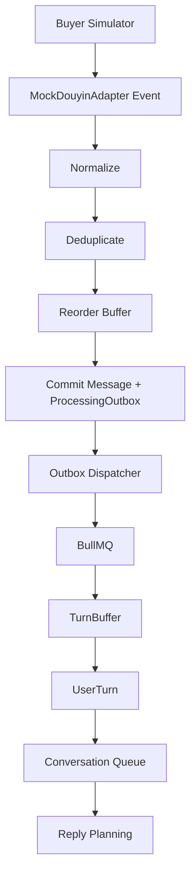

# 消息管线、并发与一致性

## 1. 完整入口链路



---

## 2. 去重

数据库唯一约束：

```text
platform + shopId + externalMessageId
```

重复事件：

- 返回已有 Message
- 不重复创建 ProcessingOutbox
- 不触发第二个 AI 任务

---

## 3. Reorder Buffer

每个 Conversation：

- lastCommittedSequence
- expectedSequence
- bufferedMessages

收到未来 sequence：

```text
expected 102
actual 103
→ 缓冲 103
→ 等待 1 秒
```

1 秒内 102 到达：

```text
commit 102
commit 103
```

仍缺失：

- Reconciliation 一次
- 仍缺：DEGRADED
- AUTO 禁止
- ASSIST / MANUAL 可用

迟到消息：

- 插入正确 sequence
- contextVersion + 1
- Summary DIRTY
- 未发送 Job STALE

---

## 4. TurnBuffer

Key：

```text
workspaceId:shopId:conversationId
```

参数：

```text
idle = 2s
hard max = 5s
```

存储：

- firstSequence
- latestSequence
- openedAt
- lastMessageAt
- idleDeadline
- hardDeadline
- generation
- status

Flush：

```text
min(idleDeadline, hardDeadline)
```

Delayed Job 带 generation。

---

## 5. 多媒体 Turn

以下内容可以进入同一 Turn：

- 图片 + 文字说明
- 商品卡 + 文字
- 订单卡 + 文字
- 多条短文本

图片分析可在 UserTurn 创建后异步执行，但 Reply Planning 必须等待当前 Task 所需的图片结果或降级。

---

## 6. 并发模型

### 6.1 同一 Conversation

```text
concurrency = 1
```

任意时刻一个有效 ReplyJob。

### 6.2 不同 Conversation

可以并行。

### 6.3 单店铺 AI 生成

```text
max = 3
```

### 6.4 全局 AI 生成

```text
max = 6
```

### 6.5 单店铺发送

```text
max = 1
```

V1 不做店铺公平调度；普通队列即可。生产优化写入设计文档但不实现。

---

## 7. Coalescing

新 UserTurn 到来时不无限堆 ReplyJob。

```text
active Job → STALE
needsReplan = true
```

后续 Turn 只更新：

- Structured Facts
- Open Tasks
- superseded Tasks
- activeTopic
- contextVersion

Worker 空闲时重新规划一次。

---

## 8. TaskBundle

最多 4 个 Task。

READ Task 可并行：

- Product
- Inventory
- Order
- Logistics
- Knowledge

写操作不直接并行，由 Action Policy 仲裁。

---

## 9. Partial Result

每个 TaskResult：

- status
- facts
- evidence
- errorCode
- blocking

规则：

- 非阻塞失败：可以部分回答
- Blocking Failure：整轮禁止 AUTO
- 不得忽略用户未回答的问题
- Action 没有 Receipt 时不得宣称成功

---

## 10. SendGuard

检查：

```text
lastMessageId
sequence
contextVersion
humanActive
idempotencyKey
```

不检查管理员刚修改的 Knowledge Revision。

失败结果：

```text
SEND_CONFLICT
HUMAN_ACTIVE
CONTEXT_STALE
DUPLICATE_ACTION
```

---

## 11. 模式变化

### AUTO → ASSIST_ONLY

生成可以继续，但 Draft 进入 WAITING_HUMAN。

### → MANUAL_ONLY

- pending 取消
- generating Abort / logical cancel
- Scheduled 自动消息取消
- 已发消息保留

重新开启：

- 不恢复旧任务
- 按最新 Context 重新评估

---

## 12. 浏览器多标签

业务状态只在服务端。

浏览器本地只保存：

- selectedShop
- selectedConversation
- panel state
- trace toggle

Tab A 修改 MANUAL 后，Tab B 通过 WebSocket 同步。

---

## 13. Processing Outbox

同事务：

```text
Message
+
ProcessingOutbox
```

Dispatcher 投递 BullMQ。

Consumer 使用 eventId / turnKey / business unique key 幂等。

---

## 14. 服务重启

详见 Recovery Worker：

- TurnBuffer 恢复
- ReplyJob 恢复
- Workflow 恢复
- SendOutbox SENDING → UNCERTAIN
- 不丢 Message
