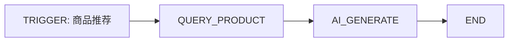
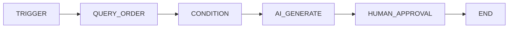

# 小型可视化 Agent Workflow Engine

## 1. V1 目标

做一个小而真的 Workflow Engine，不做通用低代码平台。

必须支持：

- 拖拽节点
- 连线
- 节点参数
- 草稿
- 发布
- 版本
- 启停
- 运行日志
- 人工审批
- 恢复

---

## 2. 节点类型

```text
TRIGGER
CONDITION
QUERY_PRODUCT
QUERY_ORDER
QUERY_LOGISTICS
AI_GENERATE
HUMAN_APPROVAL
END
```

可根据实现增加 `TEMPLATE_REPLY`，但不是必须。

---

## 3. Workflow Definition

```json
{
  "nodes": [],
  "edges": [],
  "settings": {
    "maxSteps": 20,
    "timeoutMs": 30000
  }
}
```

发布前校验：

- 必须有 Trigger
- 必须可达 End
- 不允许孤立节点
- V1 不允许循环
- 不允许超过 maxSteps
- 工具必须在 Allowlist
- 高风险 Action 必须连接 Human Approval

---

## 4. 草稿与发布

```text
Draft
→ Validate
→ Publish Version N
```

Published Version 不可修改。

修改产生新 Draft。

WorkflowRun 固定 versionId。

---

## 5. 主工作流：商品推荐



参数：

- topN：默认 3
- category?
- budget?
- compatibility?
- tone

结果返回 TaskResult，不直接发送消息。

---

## 6. 第二模板：售后协商



V1 不接真实售后平台，只演示 Proposal / Approval / Mock Receipt。

---

## 7. Workflow Router

输入 TaskBundle。

规则：

- 一个 Task 一个 Owner
- 多个 READ Workflow 可并行
- 同 Task 多个候选 Workflow 时用 priority
- 售后 / 投诉高于 Generic FAQ
- 最终统一 Reply Composer

Task 保存：

```text
ownerWorkflowRunId
```

---

## 8. WorkflowRun

保存：

- workflowVersionId
- conversationId
- taskIds
- contextVersion
- currentNodeId
- completedNodes
- status
- startedAt / finishedAt

每个 NodeRun 保存：

- input
- output
- status
- duration
- error
- retryCount

---

## 9. Human Approval

状态：

```text
WAITING_APPROVAL
```

UI 展示：

- 动作
- 目标订单 / 商品
- 风险
- 依据
- Payload

人工：

- 批准
- 拒绝

批准后：

```text
REVALIDATING
→ contextVersion
→ conversation
→ order / product
→ proposal
```

不一致：

```text
STALE
```

---

## 10. 动作风险

### READ

- getProduct
- getOrder
- getLogistics
- getInventory

自动。

### LOW_WRITE

- markRead
- createInternalTask

白名单自动 + 幂等 + Audit。

### MEDIUM_WRITE

- transferHuman
- addOrderRemark

人工确认。

### HIGH_RISK

- refund
- compensation
- exchange

V1 只 Proposal + Mock Approval。

---

## 11. Workflow 恢复

服务重启：

```text
RUNNING
→ RECOVERING
```

- Context 有效：从未完成节点继续
- Context 变化：STALE / CANCELLED
- WAITING_APPROVAL 保留
- 批准时再校验

---

## 12. 运行日志

Developer Trace / Admin 显示：

```text
14:31:02 TRIGGER success
14:31:03 QUERY_PRODUCT 3 items
14:31:05 AI_GENERATE success
14:31:05 END
```

不记录完整 Secret 或私有 Prompt。
